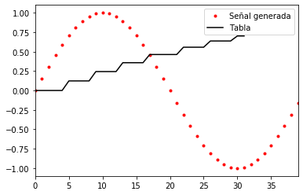

PAV - P5: síntesis musical polifónica
=====================================

Obtenga su copia del repositorio de la práctica accediendo a [Práctica 5](https://github.com/albino-pav/P5) y
pulsando sobre el botón `Fork` situado en la esquina superior derecha. A continuación, siga las instrucciones de la
[Práctica 3](https://github.com/albino-pav/P3) para crear una rama con el apellido de los integrantes del grupo de
prácticas, dar de alta al resto de integrantes como colaboradores del proyecto y crear la copias locales del
repositorio.

Como entrega deberá realizar un *pull request* con el contenido de su copia del repositorio. Recuerde que los
ficheros entregados deberán estar en condiciones de ser ejecutados con sólo ejecutar:

~~~~~~~~~~~~~~~~~~~~~~~~~~~~~~~~~~~~~~~~~~~~~~~~~~~~~.sh
  make release
~~~~~~~~~~~~~~~~~~~~~~~~~~~~~~~~~~~~~~~~~~~~~~~~~~~~~

A modo de memoria de la práctica, complete, en este mismo documento y usando el formato *markdown*, los ejercicios
indicados.

Ejercicios.
-----------

### Envolvente ADSR.

Tomando como modelo un instrumento sencillo (puede usar el InstrumentDumb), genere cuatro instrumentos que permitan
visualizar el funcionamiento de la curva ADSR.

* Un instrumento con una envolvente ADSR genérica, para el que se aprecie con claridad cada uno de sus parámetros:
  ataque (A), caída (D), mantenimiento (S) y liberación (R).
  
  Para ello, utilizamos el instrumento InstrumentDumb proporcionado al inicio de la práctica:
  
  (gràfica doremi.wav)
  
* Un instrumento *percusivo*, como una guitarra o un piano, en el que el sonido tenga un ataque rápido, no haya
  mantenimiemto y el sonido se apague lentamente.
  
  Hemos escogido hacer un piano. El procedimiento, ha sido copiar los ficheros seno.cpp y seno.h (hecho en el apartado siguiente), cambiarles el nombre por piano.cpp y piano.h y añadir en instrumentos.cpp y meson.build este nuevo instrumento.
  La diferencia respecto al "instrumento" seno son los parámetros ADSR, que son (hecho en el fichero new_instrument.orc):
  
  > Piano	ADSR_A=0.01; ADSR_D=0.5; ADSR_S=0; ADSR_R=0.5; N=40;
  
  (grafica doremi_piano.wav)
  
  - Para un instrumento de este tipo, tenemos dos situaciones posibles:
    * El intérprete mantiene la nota *pulsada* hasta su completa extinción.
    * El intérprete da por finalizada la nota antes de su completa extinción, iniciándose una disminución rápida del
      sonido hasta su finalización.
  - Debera representar en esta memoria **ambos** posibles finales de la nota.
  
* Un instrumento *plano*, como los de cuerdas frotadas (violines y semejantes) o algunos de viento. En ellos, el
  ataque es relativamente rápido hasta alcanzar el nivel de mantenimiento (sin sobrecarga), y la liberación también
  es bastante rápida.
  
  Hemos escogido hacer una trompeta, siguiendo el mismo procedimiento que para el piano. Los parámetros para la trompeta son:
  
  > 1	Trompeta	ADSR_A=0.03; ADSR_D=0.4; ADSR_S=0.3; ADSR_R=0.3; N=40;
  
  (gràfica doremi_trompeta.wav)

Para los cuatro casos, deberá incluir una gráfica en la que se visualice claramente la curva ADSR. Deberá añadir la
información necesaria para su correcta interpretación, aunque esa información puede reducirse a colocar etiquetas y
títulos adecuados en la propia gráfica (se valorará positivamente esta alternativa).

### Instrumentos Dumb y Seno.

Implemente el instrumento `Seno` tomando como modelo el `InstrumentDumb`. La señal **deberá** formarse mediante
búsqueda de los valores en una tabla.

- Incluya, a continuación, el código del fichero `seno.cpp` con los métodos de la clase Seno.
~~~~~~~~~~~~~~~~~~~~~~~~~~~~~~~~~~~~~~~~~~~~~~~~~~~~~~~~~~~~~~~~~~~~~~~~~~~~~~~~~.sh
/* Cada vez que el programa encuentra un comando MIDI en el fichero score, 
invoca al método command() de la clase, que toma por argumentos los campos del fichero score, 
esto es: el comando, la nota y la velocidad. */
void Seno::command(long cmd, long note, long vel) {
    // Si el comando es NoteOn (9), el método declara activo al instrumento
  if (cmd == 9) {		//'Key' pressed: attack begins
    bActive = true;
    adsr.start();
    F0 = (440*pow(2,((float)note - 69.0)/12.0));
		index = 0; // contador, para recorrer la tabla
    salto = (F0*tbl.size())/SamplingRate; 
	  A = vel / 127.; //amplitud
  }
  else if (cmd == 8) {	//'Key' released: sustain ends, release begins
    adsr.stop();
  }
  else if (cmd == 0) {	//Sound extinguished without waiting for release to end
    adsr.end();
  }
}

// síntesis de la señal
const vector<float> & Seno::synthesize() {
  // la curva ADSR ya ha llegado a su final
  if (not adsr.active()) {
    x.assign(x.size(), 0); //asignamos a la señal sintetizada el valor de 0
    bActive = false; //marcamos nota como inactiva
    return x;
  }
  // Si ya ha sido marcada como inactiva
  else if (not bActive)
    return x;

  // Si la nota está activa, el método realiza la síntesis
  for (unsigned int i=0; i<x.size(); ++i) {
    x[i] = A * tbl[index];
    index += salto;
    while (index >= tbl.size())
      index -= tbl.size();
  }
  adsr(x); //apply envelope to x and update internal status of ADSR

  return x;
}
~~~~~~~~~~~~~~~~~~~~~~~~~~~~~~~~~~~~~~~~~~~~~~~~~~~~~~~~~~~~~~~~~~~~~~~~~~~~~~~~~

- Explique qué método se ha seguido para asignar un valor a la señal a partir de los contenidos en la tabla, e incluya
  una gráfica en la que se vean claramente (use pelotitas en lugar de líneas) los valores de la tabla y los de la
  señal generada.
  
  Cogiendo como modelo InstrumentDumb, hemos tenido que hacer las siguientes modificaciones:
  
    + En el método *synthesize*:
    
      Ahora no recorremos la tabla de una muestra en una, sino que depende de un salto para que implemente la nota correcta (explicado justo abajo). Si este salto es mayor que el tamaño de la tabla, le restamos este valor (un periodo de la señal). Para que haga las operaciones correctamente, hemos tenido que cambiar la variable index a float en seno.h.
      
    + En el método *command*:
    
	En InstrumentDumb reproducía todos los sonido como si fueran la misma nota. Para que lo haga correctamente, tenemos que calcular la frecuencia fundamental (f0), que sacamos del enunciado de la práctica (p13):
	> Note=69+12·log2(f0/440)
      
	Calculamos f0 para posteriormente calcular el salto mencionado en el punto anterior, a partir de la siguiente fórmula:
	> F0= (fm*salto)/N
      
  Donde fm es la frecuencia de muestreo (SamplingRate) y N es el número de muestras de un periodo de señal, que al mismo tiempo, es el tamaño de la tabla (x.size()).
      
  Para hacer la gráfica, hemos añadido en seno.cpp código para que se genere un fichero con los valores de la señal generada y los valores de la tabla.
      
~~~~~~~~~~~~~~~~~~~~~~~~~~~~~~~~~~~~~~~~~~~~~~~~~~~~~~~~~~~~~~~~~~~~~~~~~~~~~~~~~.sh
std::ofstream table_file ("table.txt"), x_file ("x.txt");
~~~~~~~~~~~~~~~~~~~~~~~~~~~~~~~~~~~~~~~~~~~~~~~~~~~~~~~~~~~~~~~~~~~~~~~~~~~~~~~~~
      
  **Valores de la tabla**: Dentro del for del constructor, donde se genera la misma tabla.
~~~~~~~~~~~~~~~~~~~~~~~~~~~~~~~~~~~~~~~~~~~~~~~~~~~~~~~~~~~~~~~~~~~~~~~~~~~~~~~~~.sh
for (int i=0; i < N ; ++i) {
    tbl[i] = sin(phase);
    x_file << tbl[i] << std::endl;
    phase += step;
  }
~~~~~~~~~~~~~~~~~~~~~~~~~~~~~~~~~~~~~~~~~~~~~~~~~~~~~~~~~~~~~~~~~~~~~~~~~~~~~~~~~

  **Valores de la señal generada**: Dentro del for del método synthesize(), donde se escriben los valores de la señal (x).

~~~~~~~~~~~~~~~~~~~~~~~~~~~~~~~~~~~~~~~~~~~~~~~~~~~~~~~~~~~~~~~~~~~~~~~~~~~~~~~~~.sh
for (unsigned int i=0; i<x.size(); ++i) {
    x[i] = A * tbl[index];
    table_file << x[i] << std::endl;
    index += salto;
    while (index >= tbl.size())
      index -= tbl.size();
  }
~~~~~~~~~~~~~~~~~~~~~~~~~~~~~~~~~~~~~~~~~~~~~~~~~~~~~~~~~~~~~~~~~~~~~~~~~~~~~~~~~
      
  Una vez generados los ficheros, hemos hecho un jupyter notebook con lenguaje python que lee los ficheros y representa en una misma figura las dos gráficas (plotter.ipynb).
  

Aunque el resultado no acaba de estar bien. No se ve con claridad debido que se representa un segmento muy corto de señal y tabla. Si miramos el fichero table.txt solo tiene 30 muestras, esto es porque estamos escribiendo los valores del primer tic. Hemos intentado diferentes soluciones posibles pero que no las debemos haber implementado bien puesto que los resultados eran iguales o peores:
1) Utilizar el programa sin modificar para obtener, por un lado, la señal a una cierta frecuencia, y, por otro, la señal a la frecuencia natural de la tabla (aquella para la que la tabla se recorre muestra a muestra).
2) Modificar la constante BSIZE para que tu modificación del programa saque un segmento más largo.
Los resultados que esperábamos, sin embargo, es que se vea que los valores que recorre la sinusoide generada se correponden con los valores presentes en la tabla.
  
- Si ha implementado la síntesis por tabla almacenada en fichero externo, incluya a continuación el código del método
  `command()`.

### Efectos sonoros.

- Incluya dos gráficas en las que se vean, claramente, el efecto del trémolo y el vibrato sobre una señal sinusoidal.
  Deberá explicar detalladamente cómo se manifiestan los parámetros del efecto (frecuencia e índice de modulación) en
  la señal generada (se valorará que la explicación esté contenida en las propias gráficas, sin necesidad de
  *literatura*).
  
  (gràfica doremi_tromp_trem.wav)
  
  (gràfica doremi_tromp_vibr.wav)
  
- Si ha generado algún efecto por su cuenta, explique en qué consiste, cómo lo ha implementado y qué resultado ha
  producido. Incluya, en el directorio `work/ejemplos`, los ficheros necesarios para apreciar el efecto, e indique,
  a continuación, la orden necesaria para generar los ficheros de audio usando el programa `synth`.

### Síntesis FM.

Construya un instrumento basado en síntesis FM, siguiendo las explicaciones contenidas en el enunciado y el artículo
de [John M. Chowning](https://ccrma.stanford.edu/sites/default/files/user/jc/fm_synthesispaper-2.pdf). El instrumento
usará como parámetros **básicos** los números `N1` y `N2`, y el índice de modulación `I`, que deberá venir expresado
en semitonos.

- Use el instrumento para generar un vibrato de *parámetros razonables* e incluya una gráfica en la que se vea,
  claramente, la correspondencia entre los valores `N1`, `N2` e `I` con la señal obtenida.
- Use el instrumento para generar un sonido tipo clarinete y otro tipo campana. Tome los parámetros del sonido (N1,
  N2 e I) y de la envolvente ADSR del citado artículo. Con estos sonidos, genere sendas escalas diatónicas (fichero
  `doremi.sco`) y ponga el resultado en los ficheros `work/doremi/clarinete.wav` y `work/doremi/campana.work`.
  * También puede colgar en el directorio work/doremi otras escalas usando sonidos *interesantes*. Por ejemplo,
    violines, pianos, percusiones, espadas láser de la [Guerra de las Galaxias](https://www.starwars.com/), etc.

### Orquestación usando el programa synth.

Use el programa `synth` para generar canciones a partir de su partitura MIDI. Como mínimo, deberá incluir la
*orquestación* de la canción *You've got a friend in me* (fichero `ToyStory_A_Friend_in_me.sco`) del genial
[Randy Newman](https://open.spotify.com/artist/3HQyFCFFfJO3KKBlUfZsyW/about).

- En este (lamentable) arreglo, la pista 1 corresponde al instrumento solista (puede ser un piano, flautas, violines,
  etc.), y la 2 al bajo (bajo eléctrico, contrabajo, tuba, etc.).
- Coloque el resultado, junto con los ficheros necesarios para generarlo, en el directorio `work/music`.
- Indique, a continuación, la orden necesaria para generar la señal (suponiendo que todos los archivos necesarios
  están en direcotorio indicado).

También puede orquestar otros temas más complejos, como la banda sonora de *Hawaii5-0* o el villacinco de John
Lennon *Happy Xmas (War Is Over)* (fichero `The_Christmas_Song_Lennon.sco`), o cualquier otra canción de su agrado
o composición. Se valorará la riqueza instrumental, su modelado y el resultado final.
- Coloque los ficheros generados, junto a sus ficheros `score`, `instruments` y `efffects`, en el directorio
  `work/music`.
- Indique, a continuación, la orden necesaria para generar cada una de las señales usando los distintos ficheros.
